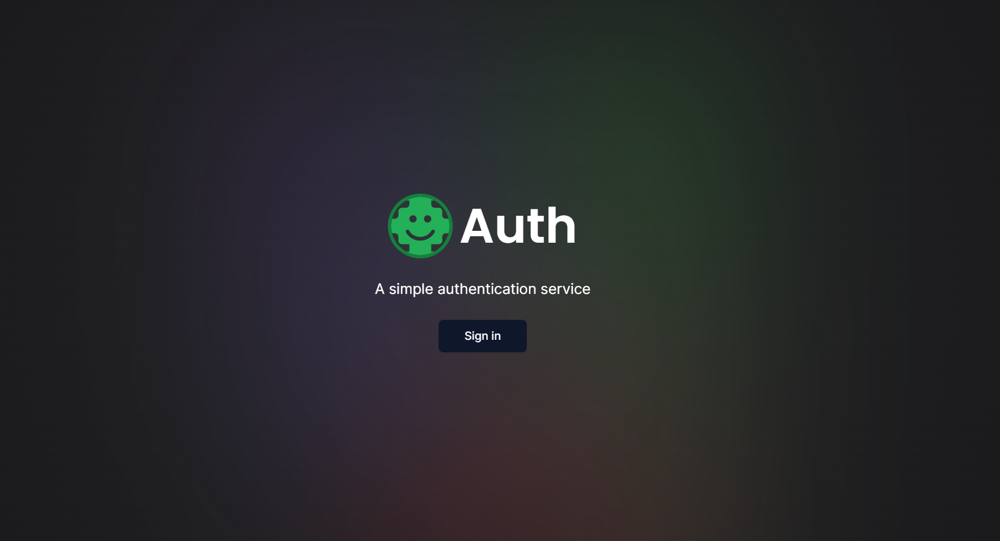
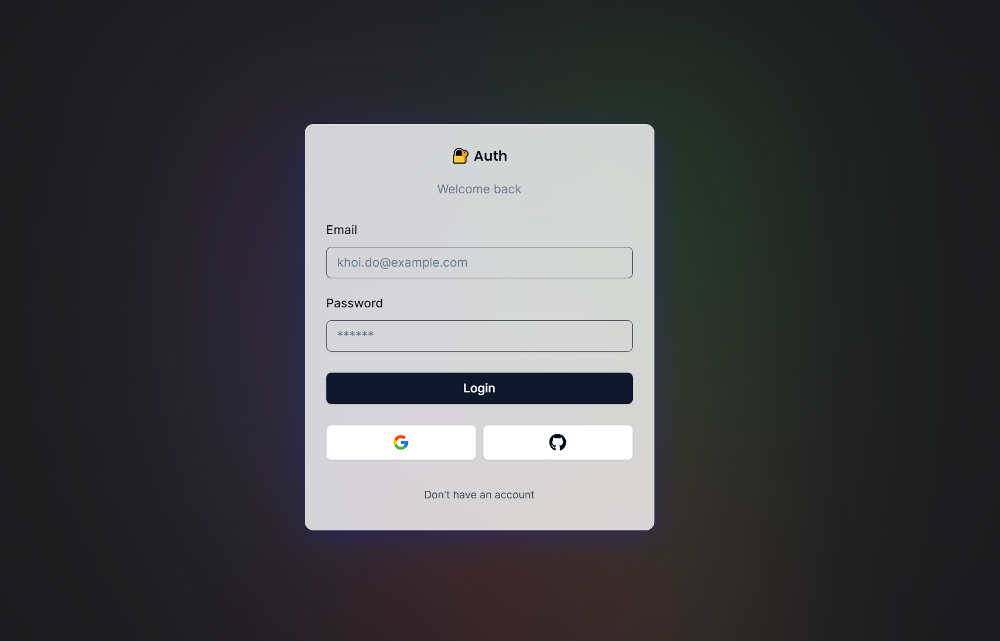

# Next.js Authentication Application

This project showcases user authentication using NextAuth, Prisma, Shadcn/UI, and Tailwind CSS.

## Screenshots


*Caption for Screenshot 1.*


*Caption for Screenshot 2.*

## Features

- User authentication with NextAuth
- Database integration with Prisma
- UI components from Shadcn/UI
- Styling with Tailwind CSS

## Prerequisites

Make sure you have the following installed before running the project:

- Node.js and npm (Node Package Manager)
- PostgreSQL database (or another supported database for Prisma)

## Getting Started

1. **Clone the repository:**

    ```bash
    git clone https://github.com/khoido2003/Next-Auth-Guide.git
    cd Next-Auth-Guide
    ```

2. **Install dependencies:**

    ```bash
    npm install
    ```

3. **Set up your environment variables:**

    Create a `.env.local` file in the root directory and add the following:

    ```env
    DATABASE_URL=your_database_url
    NEXTAUTH_URL=http://localhost:3000
    # Add other necessary environment variables for Prisma and NextAuth
    ```

4. **Run database migrations:**

    ```bash
    npx prisma migrate dev
    ```

5. **Start the development server:**

    ```bash
    npm run dev
    ```

    The application will be available at `http://localhost:3000`.

## Project Structure

- `pages/`: Next.js pages
- `public/`: Static assets
- `styles/`: Global styles and Tailwind CSS configurations
- `components/`: Reusable React components
- `prisma/`: Prisma database schema and configurations

## Technologies Used

- [Next.js](https://nextjs.org/)
- [NextAuth](https://next-auth.js.org/)
- [Prisma](https://www.prisma.io/)
- [Shadcn/UI](https://github.com/shadcn/ui)
- [Tailwind CSS](https://tailwindcss.com/)


## Learn More

To learn more about Next.js, take a look at the following resources:

- [Next.js Documentation](https://nextjs.org/docs) - learn about Next.js features and API.
- [Learn Next.js](https://nextjs.org/learn) - an interactive Next.js tutorial.

You can check out [the Next.js GitHub repository](https://github.com/vercel/next.js/) - your feedback and contributions are welcome!

## Deploy on Vercel

The easiest way to deploy your Next.js app is to use the [Vercel Platform](https://vercel.com/new?utm_medium=default-template&filter=next.js&utm_source=create-next-app&utm_campaign=create-next-app-readme) from the creators of Next.js.

Check out our [Next.js deployment documentation](https://nextjs.org/docs/deployment) for more details.
